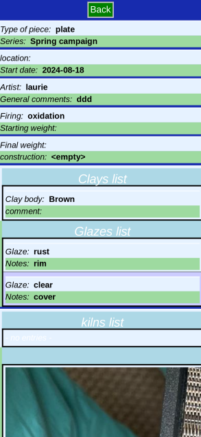
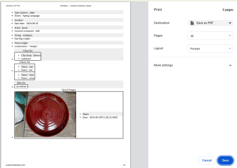
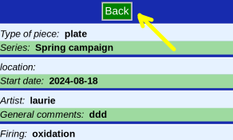

# Print

Printing shows all the piece's data, including comments and pictures.

## Display

First a page with all the formatted data is created.

## Print

The page printing is generated by the browser. You can choose your printer, page settings and then either _Print_ or _Cancel_

## Leave

Click _Back_ when done