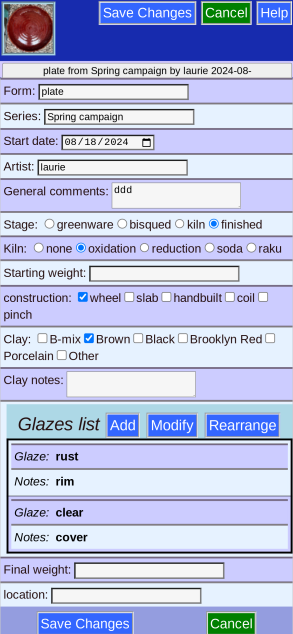
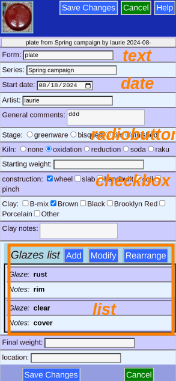
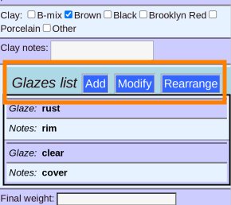
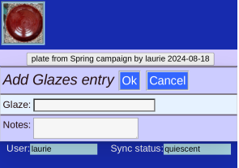
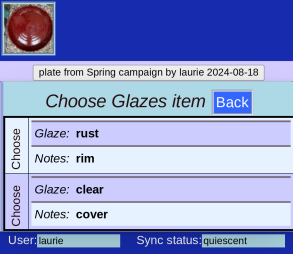
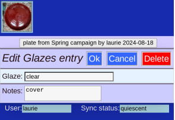
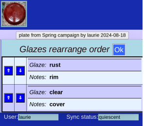
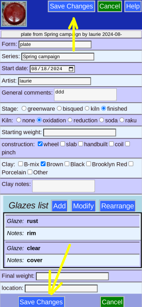

# Editing Piece

You are now able to change the piece's data (you got here from [Piece Information](PotEdit.md) )

## Field Types

* Radiobutton fields -- choose only one.
* Text fields -- free text (searchable)
* Date -- click the box to get a calendar picker
* Checkbox -- choose any number
* List -- Allows multiple entries, but needs another step to change

## List choices

Note that the options shown depend on the number of entries currently in the list.

## Add to list

Click the _Add_ button

and _Ok_ after filling in data

## Edit a List entry

If there is an existing entry, you can click the _Modify_ button and

then click on the list entry to edit (if there is more than one existing entry)

You can then accept the change (_Ok_), _Cancel_ it, or even _Delete_ this list entry altogether,

## Rearrange the List

If there is more than 2 entries, you can click the _Rearrange_ button

The arrows on the left of each entry are active

## Remember to _Save_

(Either button).