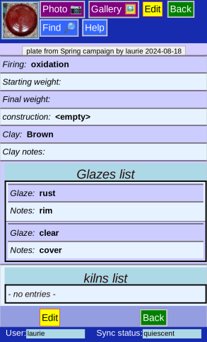
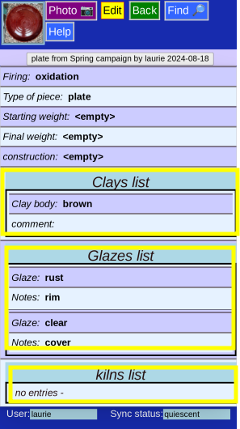
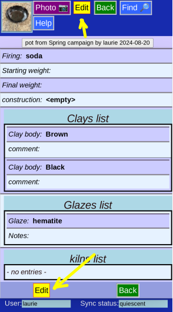
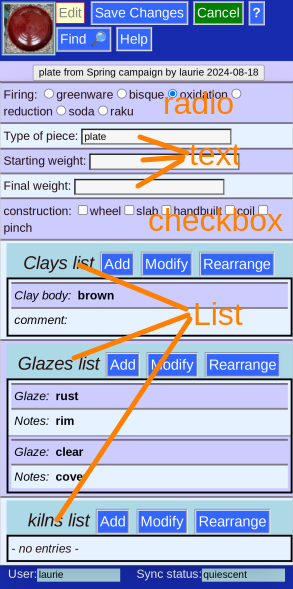
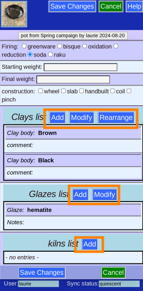
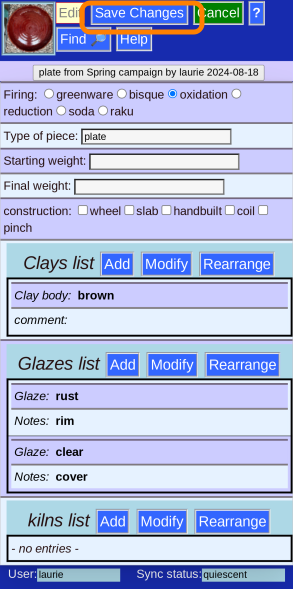

# Edit Piece -- Process Details

The _Process_ page holds a lot of information about the materials and methods used to make the piece.

The page has similarities to the simpler _General Info_ page, with the same buttons on top and bottom.

### Lists

A particular feature is that some fields can have more than one entry -- actually it's limited only by your creativity and artistic instinct.

### Edit

Click the Edit button to make changes. (Either button).

### Field Types

* Radio button fields -- choose only one.
* Text fields -- free text (searchable)
* Checkbox -- choose any number
* List -- Need to do another step to alter

## List choices

Note that the options shown depend on the number of entries currently in the list.

### Add to list

Click the _Add_ button

and _Ok_ after filling in data

### Edit a List entry

If there is an existing entry, you can click the _Modify_ button and

then click on the list entry to edit (if there is more than one existing entry)

You can then accept the change (_Ok_), _Cancel_ it, or even _Delete_ this list entry altogether,

### Rearrange the List

If there is more than 2 entries, you can click the _Rearrange_ button

The arrows on the left of each entry are active

### Remember to _Save_

(Either button).