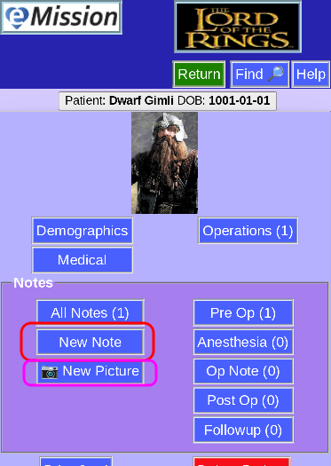
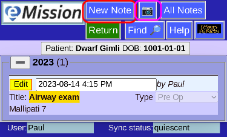

# New Photo

## Adding a new note

There are 2 ways to create a new note or photo:

From the **Patient Menu**

or from the **Note List**

## Adding content

Depending on the device you are using:

* Camera or gallery will be opened
* File area will be shown

Take a picture, or select the existing image you want to use.