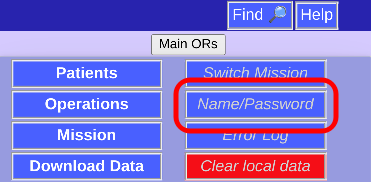
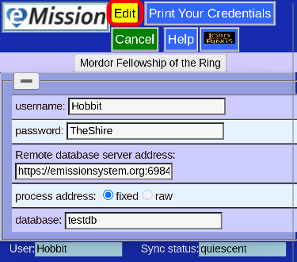
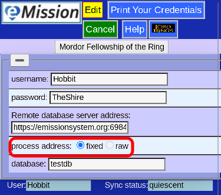
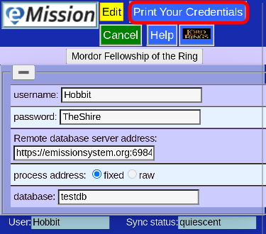
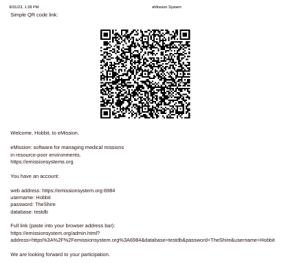

# Manually enter credentials

Often your credentials (name, password, database and server) are entered automatically from the QR code or link your Mission Leader gave you.

If you need to manually enter or correct them, choose **Name/Password** from the [Main Menu](MainMenu.html)

## Edit

You can **Edit** your information:

and press **Save Changes**

## Process Address

The *Remote database server address* has some formal parameters that can be placed automatically

|Choice|Default|Action|  
|--|--|--|
|fixed|yes|Add https(secure) and port 6984 automatically|
|raw|no|use literal address entry|

*raw* can be useful for some cloud services like *IBM Cloudant*

## Print

Alternatively, you can **Print Your Credentials**

And get a page for your records:

