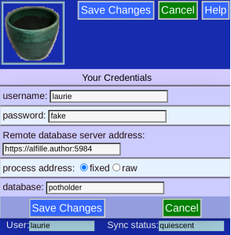

# Credentials

Although __Potholder__ without a can work freestanding, you generally want to run a database server so the data can be securely saved, shared, and used on more than one device.

The server connection requires 4 items:

* username
* password
* server web location
* database name

If this wasn't given to you in the initial link, you can enter it manually:

The program will try to fix up your server location (adding https and the port) unless you click _raw_

Remember to save your changes:

