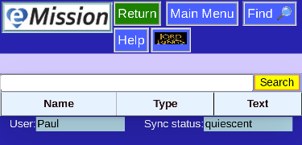
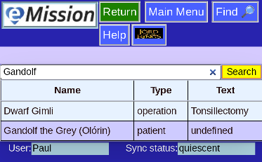

# Search

Every page has a Find button  which takes you to a database search page.

Enter the word or phrase and press "Search". All the text fields in the Mission will be examined.

The records matched are shown. Click on any of them to jump to that page.

In this case, you can see that **Gandolf** matched two different types of records.

