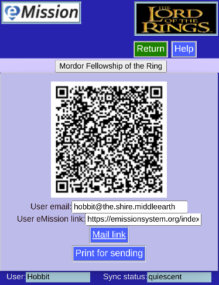

# Send User Info

After a patient is created or edited, this page is useful for user communication.

* **Main link** can be problematic due to different email clients and modern security restrictions

* **Print for sending** produces output like this:

Which can be sent, or saved as a PDF file (if you have that driver on your system).