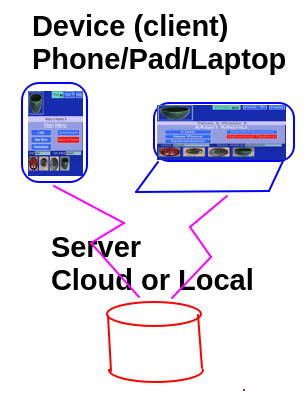

# Server

## Client

* Technically _Potholder_ runs on any web browser  
  * e.g. Chrome, Edge, Safari, Firefox,...
* Usually the _device_ is a
  * Phone e.g. iPhone,, Android, ...
  * Pad e.g. iPad, Surface, ...
  * Computer
    * Laptop or Desktop
    * Mac, Windows, Chromebook, Linux...
 * The program _Potholder_ is loaded automatically from the website and stored in the _device_
 * Data (e.g. all your records and pictures) are kept on the _device_
    * You can optionally [clear the local data](Administration.md) if you have it backed up to a server
  * _For the technically minded_ 
    * _Potholder_ is a pure javascript program 
    * The code is stored in local cache
    * The data is stored in the browser database (IndexDB)
    * _PouchDB_ is the (javascript) database component
    * _PouchDB_ automatically replicates the data to a server periodically (And back)
    * All the code is free and open source
    
## Server

### Do you need a server?
While is isn't required to have a server, your data is vulnerable and difficult to share if only hosted in your _device_. Also, if you use more than one device, you need a server to synchronize the data between them.

### What is the server serving?
 * Web program (_potholder_) or go to [my server](https:alfille.online)
 * Database [Couchdb](https://couchdb.apache.org)

### What type of servers are there?

* Local server -- can be as simple as a Raspberry Pi
* Cloud Server -- needs some expertise and a monthly fee
  * Cheapest is around $5/month in 2024
* IBM Cloudant -- free lowest tier
  * Not especially easy to set up, although there are good tutorials
  * Should be easy to stay within memory and bandwidth
* Combination
  * Each server can replicate the data to the others providing continuous backup
  * Each _device_ talks to the server and is kept up to date

## Security

_Potholder_ is actually quite secure

* The web browser protects your device from programs running in it
* No second-hand updates or code is run
  * Libraries are hosted by the _potholder_ website
* Communication to the server uses _https_ encryption
* Network communication
  * server for data
  * website for help pages
* Access to your device is solely to get a picture (camera or file) using standard browser methods.
* Cookies are used only for the credentials to access the server

