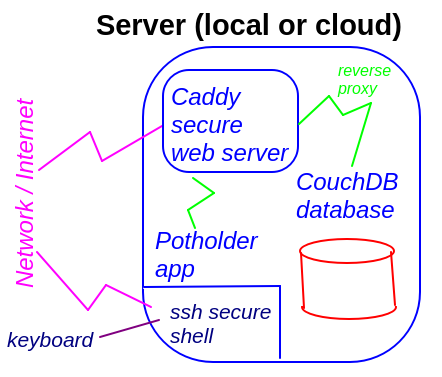

# Software Setup

We now need to configure the software components:

## Name/Password

There are 3 name/password combinations you will need

* Server
  * This is the _username_ and _password_ for your server 
  * Use this to connect with _ssh_ or log in directly at the console
  * Call this your _username_ and _system_password_
* CouchDb Administrator
  * User: _admin_
  * Password: choose a good one (could be your _system_password_ since it is securely handled)
  * Call this _admin_ and _admin_password_
* CouchDb User
  * Choose an _artist_name_
  * Choose an _artist_password_
 
 ## 