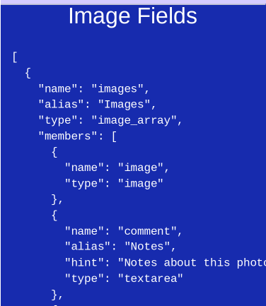

# Schema Menus

A menu of the data schema.

## General Properties

JSON formatted schema corresponding to [Piece Information](PotEdit.md)

## Images

JSON formatted schema for [Images](PotPix.md)

## User Credentials

Used for [User and Server info](RemoteDatabaseInput.md)

## Dataase Info

Used for [PouchDB info](DatabaseInfo.md)
