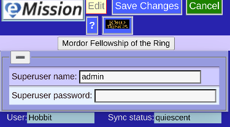

# Super User (Top level access)

The level allows User administration (Add/Edit/Permissions) and database console access.

The page pops up automatically when this level is needed.

Enter password and press **Save Changes** to proceed.