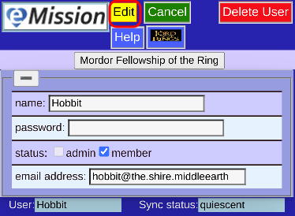
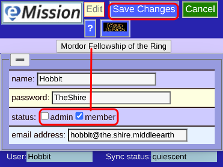

# Edit a User

Once created, you can edit a user's record, with some limitations.

* The user name cannot be changed (but you can create a new user if you wish)
* The Password can be changed, but not retrieved. 
  * If forgotten it must be created anew
  * Leaving the password blank should not reset it
* Status applies to the currently listed mission

Press **Edit** to modify the record:

Press **SaveChanges** to proceed (or **Cancel** to back out)