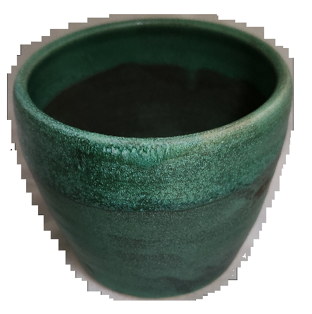

# PotHolder
## *Convenient mobile database for Ceramic Artists*

## Summary

**Potholder** is a web-based program that lets you keep track of your ceramic pieces. It works well on phones, laptops and tablets, and will synchronize automatically between all the devices when it can.

The database includes images, kiln and glaze data, and other production processes.

You don't have to install anything -- it's all there in the web page. You don't even have to be on-line to use it.