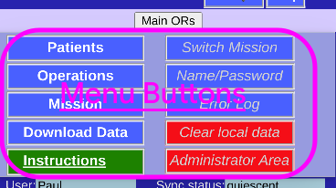
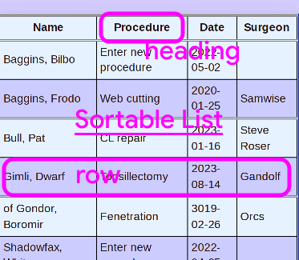
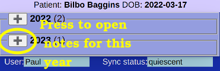
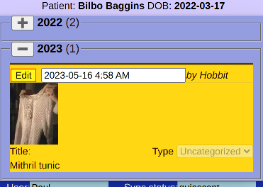
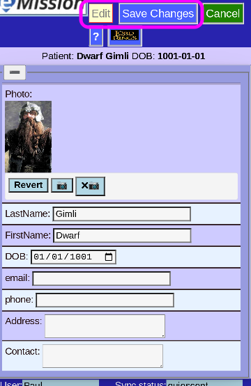

# Working Area

The central space of each page is the main working area. There are several types:

## Menus

These include buttons, checkboxes and links.

## Sortable Lists

This is a list with some properties:

* Click on any heading to sort on that property
  * Click again to reverse the sort order
* Click on any row to choose that item (Patient in this case) and navigate to the item

## Note List

Notes are the free-form text and images that keep track of patient's progress.

### Collapsed List

If more than one year is represented, the list is *collapsed*. Presse the **+** or **-** to see or hide that year.

### Expanded List

Here the (single) note from this year can be seen. It can be edited *in place* by pressing **Edit**.

## Data View/Entry

Used for viewing or entering data in a record.

* Different types of data can be represented, including pictures, text, checkboxes, and dates
* For safety, the form comes up in *view mode*
  * To edit, press **Edit** at the top
  * To store your data, press **Save Changes**
  * To Back out without saving, press **Cancel**