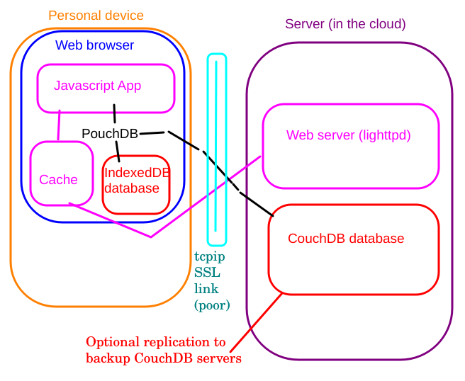

# Overall architecture

## System design

### Client-side

* Personal Device
*  * Browser
  * Smartphone / Tablet
  * Laptop / Desktop / Chromebook
  * *Intermittent network access*
* Browser
  * Runs Javascript App (ES11+)
  * Service Worker for caching App
  * PouchDB (javascript) is in-app database engine
  * Browser database (IndexedDB)
  * Replicates with Server (CouchDB)

## Server-side

* Server function
  * Stable DNS address
  * Web server and database *can* be on separate machines
* Web server
  * Deliver App and HTML for caching
  * Hold non-cached help documents
  * Preferably SSL secure
  * Implemented using *lighttpd* although basically any static content web server would work (e.g. nginx, caddy, ...)
* [CouchDB server](https://couchdb.apache.org/)
  * Manages database
  * Has own [*Fauxton*](https://docs.couchdb.org/en/stable/fauxton/index.html) web console
  * Uses *http* for communication protocol
    
## Communication

* Application (eMission)
  * Pure javascript and HTML
  * Cached locally using *Service Workers*
  * All dependencies included
* Content
  * Cached locally in browser database (IndexDB)
  * Replicates opportunistically
  * Eventually consistent
  * CouchDB replication protocol (by [PouchDB](https://pouchdb.com/))