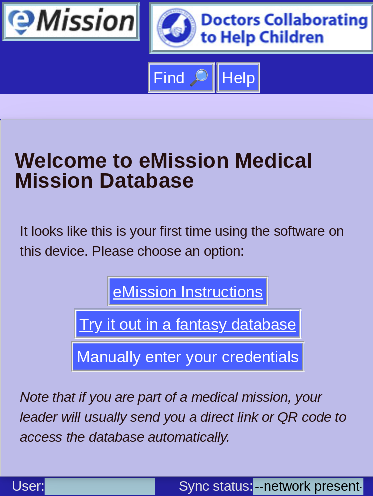

# Caddy Webserver

### Synopsis


The [caddy](https://caddyserver.com/) webserver will serve both application, web pages, and indirectly data from the database. It will also automatically aquired and keep current security certificates allowing secure SSL communication.

### Installation

If you've been following these instructions [sequentially](initial_server.html), caddy should be already installed.

### Configuration

Caddy is configured by a *Caddyfile* at `/etc/caddy/Caddyfile`

Initial contents:

```
# The Caddyfile is an easy way to configure your Caddy web server.
#
# Unless the file starts with a global options block, the first
# uncommented line is always the address of your site.
#
# To use your own domain name (with automatic HTTPS), first make
# sure your domain's A/AAAA DNS records are properly pointed to
# this machine's public IP, then replace ":80" below with your
# domain name.

:80 {
        # Set this path to your site's directory.
        root * /usr/share/caddy

        # Enable the static file server.
        file_server

        # Another common task is to set up a reverse proxy:
        # reverse_proxy localhost:8080

        # Or serve a PHP site through php-fpm:
        # php_fastcgi localhost:9000
}
```

Edit or copy `/etc/caddy/Caddyfile`to:

```
domain_name {
        # Set this path to your site's directory.
        root * /srv/www

        # Enable the static file server.
        file_server
}

domain_name:5984 {
  reverse_proxy localhost:15984
}

domain_name:6984 {
  reverse_proxy localhost:15984
}
```
Where `domain_name` is your actual chosen *domain_name*

### Startup

```
caddy fmt --overwrite /etc/caddy/Caddyfile
systemctl enable caddy
systemctl status caddy
```
### Test -- web service

From your web browser go to address *domain-name* (your chosen domain name)



### Test -- database service

From your web browser go to address *domain-name*:6984/_utils/ (using your chosen domain name)


