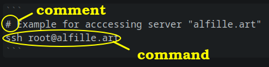
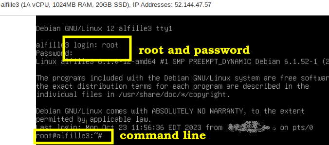

# Initial Server Steps

## Access to Server

Several way to access the server, all from the "command line"

* Physical console
* Provider web console
* SSH (Secure Shell)

### Logging In

#### SSH
```
# Example for acccessing server "alfille.art"
ssh root@alfille.art
```



Here is an example of a command -- in this case the actual command to access the server.

* alfille.art is the __*domain_name*__
* you will be prompted for the __*server_password*__
* comments start with "#" and are only present to make the instructions clearer * you don't need to include comments

All other examples will be __*on*__ the server, after logging in.

####Web Console



## Initial software update

```
apt update
apt -y upgrade
```

## Install needed software

```
apt -y install ufw git caddy snapd
```

## Install your favorites

Here is a chance to install your personal favorite software. Most commonly this will be a file editor (like *vim* or *emacs*). The included simple editor is *nano* which is more than adequate.