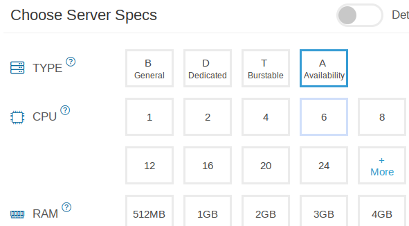

# VPS Provisioning

An unmanaged VPS is typically a shared virtual computer hosted on the cloud provider's infrastructure. They allow you to choose:

* Number of cores
* Size of RAM
* Size of hard disk
* Network bandwidth
* Level of service (guaranteed or average)
* Operating system and version
* Extras
  * Backups
  * Domains
  * Host geographical location
  

In this case, we choose:

* 1 CPU
* 1GB RAM
* 20GB Hard Disk
* Debian 12 operating system (linux)

The fee is $4/month. (This is from [Kamatera](try.kamatera.com), although roughly similar deals are available from other vendors).

Domain name will be extra.

An IP address, SSH and web console access are provided as well. There is also a management screen with overall statistics on usage.

## Essential information:

Make note of the provided __*ip_addess*__ to assign to your [domain](domain.html)

At this time, you will also be asked to create a __*server_password*__
