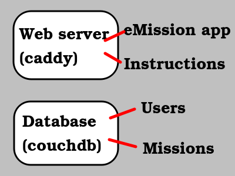
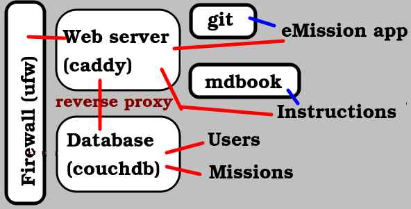
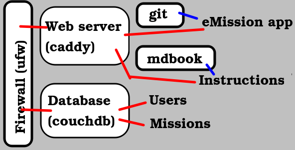

# Build your own server

This section documents the actual steps for setting up your own **eMission** server. As We assume considerable server management experience.

There are simpler ways to [set up a mission](NewMission.html). Specifically [using existing infrastructure](OurServer.html).

## Basic Structure

At the most basic level, implementing a *web server*, and a *database* that follows [couchdb protocol](https://docs.couchdb.org/en/stable/replication/protocol.html) is sufficient. Even the Instructions can be served from the [original site](https://emissionsystem.org/book/index.html) with appropriate *server redirect*.

## Current Implemented Structure

For better maintainability and security, the actual implementation includes: 

* Firewall
	* locks down server (optional but safer)
* git
  * easy update of code and markdown documentation
* mdbook
  * build html from markdown
* Web server
  * Implements SSL encryption of application and data
  * Filters database access (reverse proxy) to isolate from external attack
    * All communication goes through Web Server
    * Web Server has high-quality SSL implementation
  * Serves Javascript application and instructional HTML
  
## Prior Implemented Structure

Prior implementation included external access to CouchDB: 

* Firewall
	* filters non-SSL access to couchdb
* Web server with SSL certificates
* CouchDB with SSL certificates
  
## Platform	

**eMission** developement and server implementation has been on **Linux** (a very common server platform). The following instructions will assume linux.

There is no reason why a **Windows** server could not be used for **eMission** server deployment. All the components have windows versions. There will be differences in the file structure, service initiation, and software packaging.

If you do build on Windows, please share your experience.

